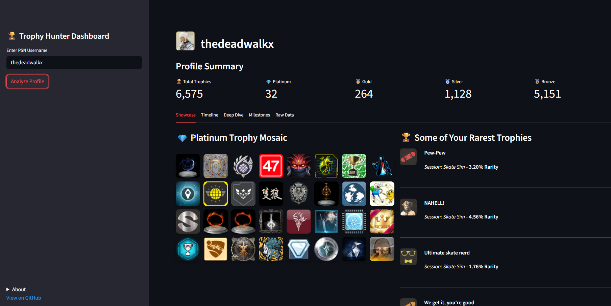
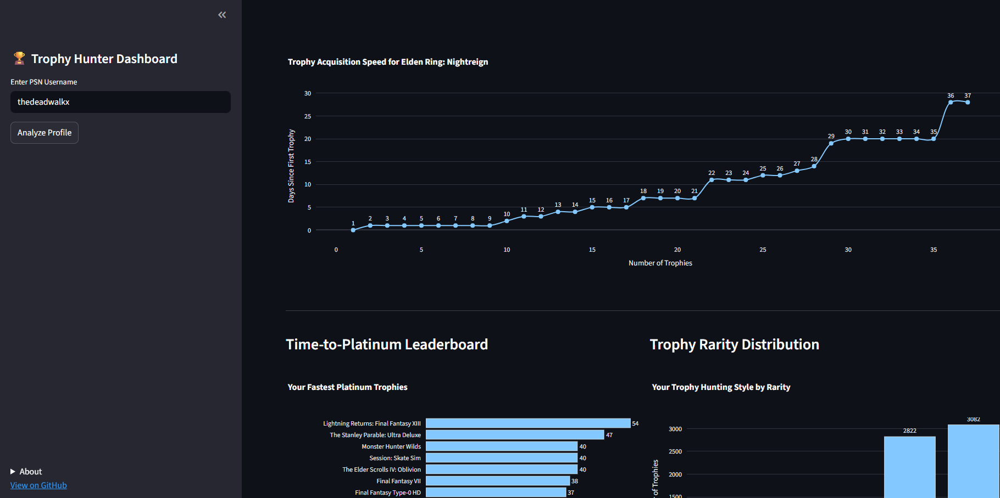
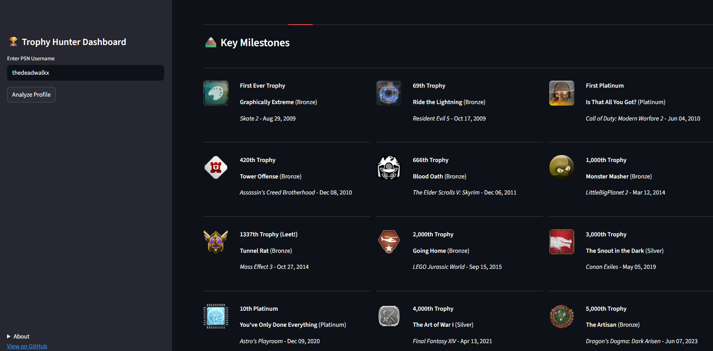
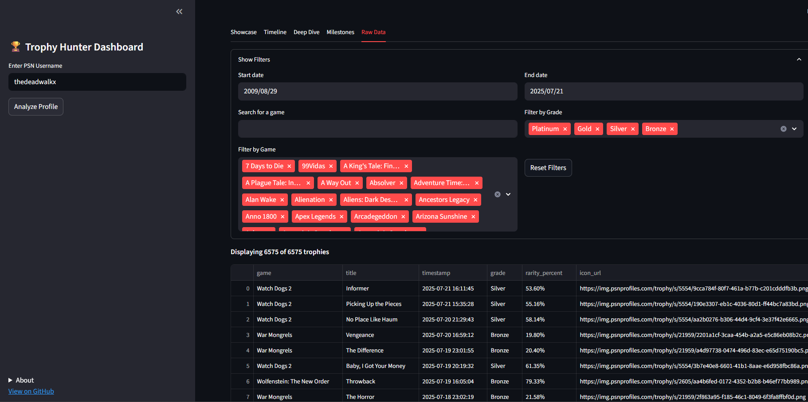

# Trophy Hunter Dashboard

A Streamlit-powered dashboard for visualizing and analyzing PlayStation trophy data, scraped from [PSNProfiles](https://psnprofiles.com/). View your trophy milestones, rarest achievements, gaming streaks, and more in a beautiful, interactive UI.

[Check it out here! 🚀](https://gonz4lex-trophy-hunter-dashboard-app-av0qbw.streamlit.app/)

---

## Features

- **Automated Scraping**: Fetches your public trophy log from PSNProfiles.
- **Caching**: Stores data locally for 24 hours to minimize scraping and speed up loading.
- **Visualizations**:
  - Trophy timeline and heatmap
  - Rarity distribution and hunting style
  - Fastest platinums leaderboard
  - Gaming streaks and activity patterns
  - Milestone trophies and more
- **Raw Data Export**: Filter and download your trophy data as CSV.
- **Responsive UI**: Built with Streamlit for easy use on desktop and mobile.

---

## Screenshots










## Getting Started

1. **Clone the repository:**
    ```sh
    git clone https://github.com/gonz4lex/trophy-hunter-dashboard.git
    cd trophy-hunter-dashboard
    ```

2. **Install dependencies:**
    ```sh
    pip install -r requirements.txt
    ```

3. **Run the app:**
    ```sh
    streamlit run app.py
    ```

---

## Usage

1. Enter your PSN username in the sidebar.
2. Click "Analyze" to fetch and visualize your trophy data.
3. Explore the tabs for Showcase, Timeline, Deep Dive, Milestones, and Raw Data.
4. Use filters and download options as needed.

---

## Project Structure

```
.
├── app.py # Main Streamlit app
├── assets # Images
├── components # UI components
│   ├── __init__.py
│   ├── utils.py
│   └── visualizations.py
├── core # Scraper and related utilities
│   ├── cache.py
│   └── scraper.py
├── LICENSE
└── README.md
```

## Data & Privacy

- Only public PSNProfiles data is scraped.
- Data is cached locally and never shared.
- Respects PSNProfiles’ terms of service and rate limits.

## Contributing

Pull requests and suggestions are welcome! Please open an issue first to discuss major changes.

## License

[MIT](LICENSE)

## Acknowledgments

- [PSNProfiles](https://psnprofiles.com/) for the trophy data.
- [Streamlit](https://streamlit.io/) for the UI framework.
